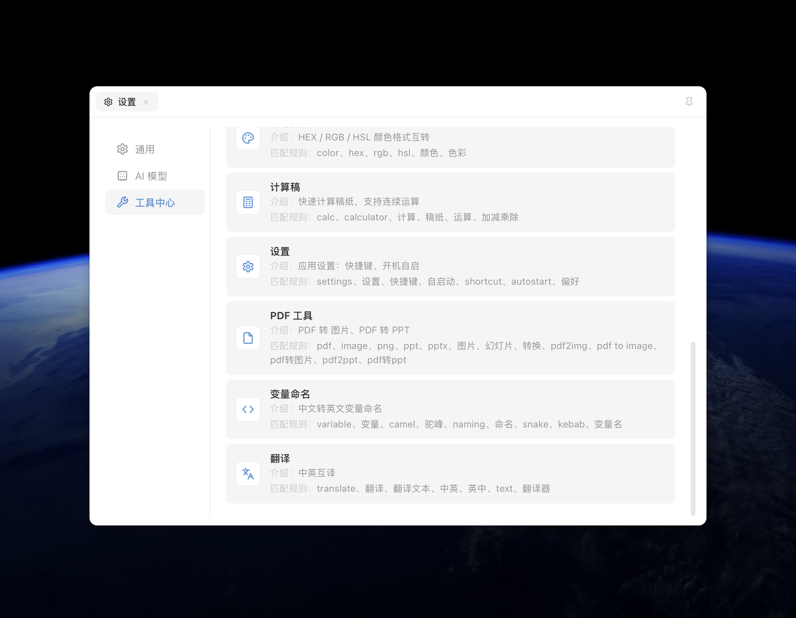
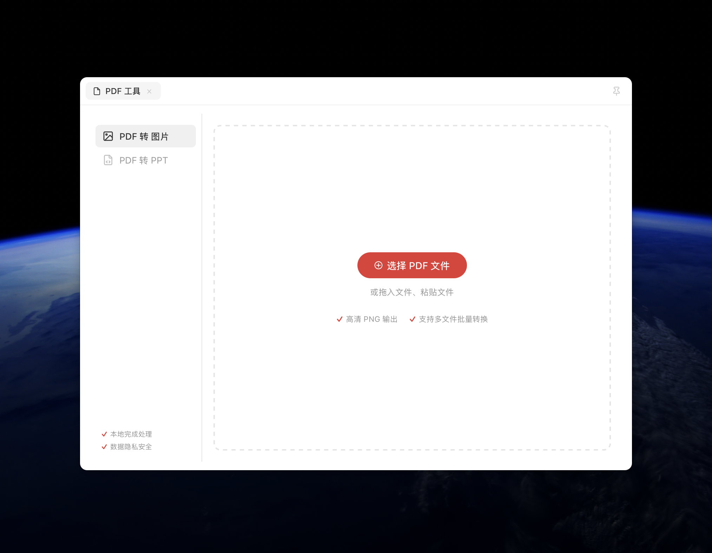
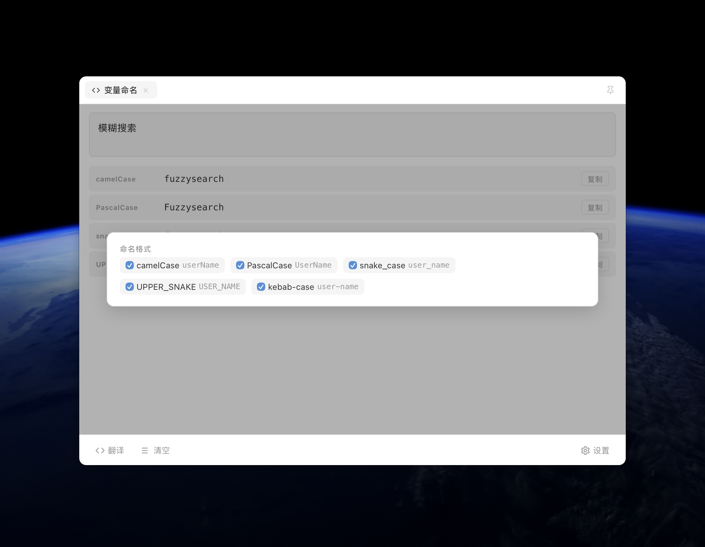

# MTools

一款 macOS 效率工具箱，全局快捷键呼出，输入即搜索，内置多种开发常用工具，支持本地 AI 翻译。

## 截图

<p align="center">
  
  
</p>
<p align="center">
  
  
</p>

## 特性

- **全局呼出** — 快捷键随时唤起搜索框，用完即走
- **模糊搜索** — 内置工具 + 系统应用混合搜索，支持拼音匹配
- **剪贴板智能识别** — 自动检测剪贴板内容，推荐匹配工具
- **文件夹直达** — 复制文件夹后唤起即提示，一键用 VSCode 或终端（Terminal / iTerm2 / Ghostty / Warp…）打开
- **本地 AI 翻译** — 内嵌 llama.cpp + Metal 推理引擎，支持 GGUF 本地模型，数据不出本机
- **系统应用快速启动** — 搜索即可打开已安装应用
- **工具直达快捷键** — 为常用工具绑定独立全局快捷键
- **零前端框架** — 原生 HTML/CSS/JS，无构建步骤，启动极快

## 内置工具

| 工具 | 说明 |
|------|------|
| JSON 格式化 | 格式化、压缩、校验、键路径过滤 |
| Base64 编解码 | 实时编码/解码，支持 Unicode |
| 时间戳转换 | Unix 时间戳 ↔ 日期互转 |
| UUID 生成器 | 批量生成 UUID v4 |
| URL 编解码 | URL 编码/解码 |
| Hash 计算 | SHA-1 / SHA-256 / SHA-512 |
| 正则测试 | 正则表达式实时匹配测试 |
| 颜色转换 | HEX/RGB/HSL 互转 + 屏幕取色 + 色卡收藏 |
| 计算稿 | 逐行表达式计算，支持多稿纸 |
| 变量命名 | 中文 → 英文变量命名（本地 LLM） |
| 翻译 | 中英互译（本地 LLM，支持直达快捷键） |
| 设置 | 快捷键、自启动、AI 模型配置、默认终端 |

## 技术栈

- **前端**：原生 HTML/CSS/JS（ES Modules，无框架）
- **后端**：Tauri v2（Rust）
- **AI 推理**：内嵌 llama.cpp + Metal，支持 Ollama / LM Studio 外部服务
- **平台**：macOS 12+

## 开发

需要 [Rust](https://rustup.rs) 和 [Node.js](https://nodejs.org) 环境。

```bash
# 安装依赖
npm install

# 开发模式
npx tauri dev

# 生产构建（输出 DMG）
cd src-tauri 
cargo clean   
npx tauri build
```

Rust 代码改动后需手动触发重编译：

```bash
cd src-tauri && cargo build
```

## 项目结构

```
MTools2/
├── src-tauri/              # Tauri 后端（Rust）
│   ├── src/lib.rs          # 主逻辑
│   ├── src/macos_picker.m  # macOS 原生取色
│   └── src/macos_icon.m    # macOS 应用图标提取
├── src/                    # 前端代码
│   ├── index.html
│   ├── main.js             # 应用控制器
│   ├── styles.css
│   ├── lib/                # 工具注册、拼音、应用启动
│   └── tools/              # 工具实现（每个工具一个文件）
└── docs/                   # 设计文档
```

## 添加新工具

1. 在 `src/tools/` 下创建新文件
2. 导出工具对象（遵循 `id`, `name`, `render()`, `destroy()` 等接口）
3. 在 `src/lib/registry.js` 中 import 并添加到 tools 数组

## 致谢

- [Tauri](https://tauri.app/) — 跨平台桌面应用框架
- [llama.cpp](https://github.com/ggml-org/llama.cpp) — 本地 LLM 推理引擎

## License

MIT
